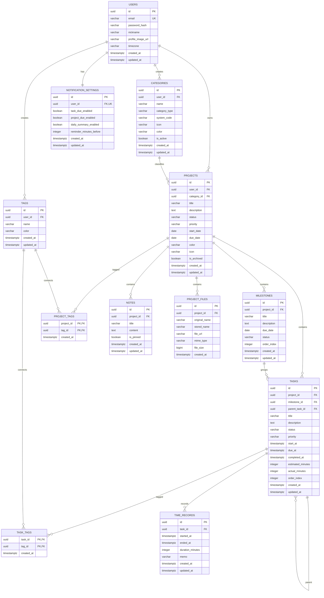

# Task Manager ERD 및 데이터베이스 테이블 설계

## 1. 설계 기준

### 데이터베이스

```text
PostgreSQL
```

### 식별자 전략

모든 주요 엔티티의 기본키는 UUID를 사용한다.

```sql
id UUID PRIMARY KEY DEFAULT gen_random_uuid()
```

UUID를 사용하는 이유는 다음과 같다.

* 프론트엔드에서 ID를 노출해도 순차 번호 추측이 어렵다.
* 향후 모바일 앱이나 분산 시스템으로 확장하기 쉽다.
* 서로 다른 환경에서 데이터를 생성해도 ID 충돌 가능성이 낮다.

PostgreSQL에서 `gen_random_uuid()`를 사용하려면 다음 확장이 필요하다.

```sql
CREATE EXTENSION IF NOT EXISTS pgcrypto;
```

---

## 2. 최종 테이블 목록

### 핵심 테이블

```text
users
categories
projects
milestones
tasks
tags
```

### 지원 테이블

```text
time_records
notes
project_files
notification_settings
```

### 관계 테이블

```text
project_tags
task_tags
```

총 12개 테이블로 구성한다.

---

# 3. 전체 ERD



---

# 4. 관계 요약

| 부모 테이블     | 자식 테이블                |  관계 | 삭제 정책    |
| ---------- | --------------------- | --: | -------- |
| users      | projects              | 1:N | CASCADE  |
| users      | categories            | 1:N | CASCADE  |
| users      | tags                  | 1:N | CASCADE  |
| users      | notification_settings | 1:1 | CASCADE  |
| categories | projects              | 1:N | RESTRICT |
| projects   | milestones            | 1:N | CASCADE  |
| projects   | tasks                 | 1:N | CASCADE  |
| projects   | notes                 | 1:N | CASCADE  |
| projects   | project_files         | 1:N | CASCADE  |
| milestones | tasks                 | 1:N | SET NULL |
| tasks      | tasks                 | 1:N | CASCADE  |
| tasks      | time_records          | 1:N | CASCADE  |
| projects   | project_tags          | 1:N | CASCADE  |
| tags       | project_tags          | 1:N | CASCADE  |
| tasks      | task_tags             | 1:N | CASCADE  |
| tags       | task_tags             | 1:N | CASCADE  |

---

# 5. 테이블별 상세 설계

## 5.1 users

회원 계정과 기본 프로필 정보를 저장한다.

```sql
CREATE TABLE users (
    id UUID PRIMARY KEY DEFAULT gen_random_uuid(),

    email VARCHAR(255) NOT NULL,
    password_hash VARCHAR(255) NOT NULL,
    nickname VARCHAR(50) NOT NULL,

    profile_image_url VARCHAR(1000),
    timezone VARCHAR(50) NOT NULL DEFAULT 'Asia/Seoul',

    created_at TIMESTAMPTZ NOT NULL DEFAULT CURRENT_TIMESTAMP,
    updated_at TIMESTAMPTZ NOT NULL DEFAULT CURRENT_TIMESTAMP,

    CONSTRAINT uq_users_email UNIQUE (email),
    CONSTRAINT chk_users_email_not_blank
        CHECK (LENGTH(TRIM(email)) > 0),
    CONSTRAINT chk_users_nickname_not_blank
        CHECK (LENGTH(TRIM(nickname)) > 0)
);
```

### 주요 규칙

* 이메일은 중복될 수 없다.
* 비밀번호 원문은 저장하지 않는다.
* `password_hash`에는 bcrypt 또는 Argon2로 암호화한 값만 저장한다.
* 시간대 기본값은 `Asia/Seoul`로 설정한다.

### 인덱스

`email`은 UNIQUE 제약조건으로 인해 자동으로 인덱스가 생성된다.

---

## 5.2 categories

공부, 운동, 과제, 포트폴리오와 같은 프로젝트 모드를 저장한다.

```sql
CREATE TABLE categories (
    id UUID PRIMARY KEY DEFAULT gen_random_uuid(),

    user_id UUID,
    name VARCHAR(50) NOT NULL,

    category_type VARCHAR(20) NOT NULL,
    system_code VARCHAR(30),

    icon VARCHAR(100),
    color VARCHAR(20),

    is_active BOOLEAN NOT NULL DEFAULT TRUE,

    created_at TIMESTAMPTZ NOT NULL DEFAULT CURRENT_TIMESTAMP,
    updated_at TIMESTAMPTZ NOT NULL DEFAULT CURRENT_TIMESTAMP,

    CONSTRAINT fk_categories_user
        FOREIGN KEY (user_id)
        REFERENCES users(id)
        ON DELETE CASCADE,

    CONSTRAINT chk_categories_type
        CHECK (category_type IN ('SYSTEM', 'CUSTOM')),

    CONSTRAINT chk_categories_system_owner
        CHECK (
            (category_type = 'SYSTEM' AND user_id IS NULL)
            OR
            (category_type = 'CUSTOM' AND user_id IS NOT NULL)
        ),

    CONSTRAINT chk_categories_system_code
        CHECK (
            (category_type = 'SYSTEM' AND system_code IS NOT NULL)
            OR
            (category_type = 'CUSTOM' AND system_code IS NULL)
        ),

    CONSTRAINT chk_categories_name_not_blank
        CHECK (LENGTH(TRIM(name)) > 0)
);
```

### 기본 카테고리 데이터

```sql
INSERT INTO categories (
    name,
    category_type,
    system_code,
    icon,
    color
)
VALUES
    ('공부', 'SYSTEM', 'STUDY', 'book', '#6366F1'),
    ('운동', 'SYSTEM', 'EXERCISE', 'dumbbell', '#22C55E'),
    ('과제', 'SYSTEM', 'ASSIGNMENT', 'clipboard', '#F97316'),
    ('포트폴리오', 'SYSTEM', 'PORTFOLIO', 'folder', '#3B82F6');
```

### 유일성 인덱스

시스템 카테고리 코드는 중복될 수 없다.

```sql
CREATE UNIQUE INDEX uq_categories_system_code
ON categories(system_code)
WHERE system_code IS NOT NULL;
```

한 사용자가 같은 이름의 커스텀 카테고리를 여러 개 만들지 못하도록 한다.

```sql
CREATE UNIQUE INDEX uq_categories_user_name
ON categories(user_id, LOWER(name))
WHERE user_id IS NOT NULL;
```

### 설계 이유

`STUDY`, `EXERCISE`, `ASSIGNMENT`, `PORTFOLIO`를 코드에만 고정하지 않고 데이터로 저장한다.

따라서 다음과 같은 확장이 가능하다.

```text
독서
자격증
여행
습관
취업 준비
개인 재무
```

---

## 5.3 projects

사용자가 관리하는 프로젝트의 기본 정보를 저장한다.

```sql
CREATE TABLE projects (
    id UUID PRIMARY KEY DEFAULT gen_random_uuid(),

    user_id UUID NOT NULL,
    category_id UUID NOT NULL,

    title VARCHAR(100) NOT NULL,
    description TEXT,

    status VARCHAR(20) NOT NULL DEFAULT 'PLANNED',
    priority VARCHAR(20) NOT NULL DEFAULT 'MEDIUM',

    start_date DATE,
    due_date DATE,

    color VARCHAR(20),
    icon VARCHAR(100),

    is_archived BOOLEAN NOT NULL DEFAULT FALSE,

    created_at TIMESTAMPTZ NOT NULL DEFAULT CURRENT_TIMESTAMP,
    updated_at TIMESTAMPTZ NOT NULL DEFAULT CURRENT_TIMESTAMP,

    CONSTRAINT fk_projects_user
        FOREIGN KEY (user_id)
        REFERENCES users(id)
        ON DELETE CASCADE,

    CONSTRAINT fk_projects_category
        FOREIGN KEY (category_id)
        REFERENCES categories(id)
        ON DELETE RESTRICT,

    CONSTRAINT chk_projects_status
        CHECK (
            status IN (
                'PLANNED',
                'IN_PROGRESS',
                'PAUSED',
                'COMPLETED',
                'CANCELLED'
            )
        ),

    CONSTRAINT chk_projects_priority
        CHECK (
            priority IN (
                'LOW',
                'MEDIUM',
                'HIGH',
                'URGENT'
            )
        ),

    CONSTRAINT chk_projects_title_not_blank
        CHECK (LENGTH(TRIM(title)) > 0),

    CONSTRAINT chk_projects_date_range
        CHECK (
            due_date IS NULL
            OR start_date IS NULL
            OR due_date >= start_date
        )
);
```

### 중요 결정: progress 컬럼 제외

`projects` 테이블에 `progress` 컬럼을 저장하지 않는다.

진행률은 작업 상태로부터 계산되는 파생 데이터이기 때문이다.

```text
진행률 = 완료된 유효 작업 수 / 전체 유효 작업 수 × 100
```

진행률을 직접 저장하면 다음과 같은 불일치가 발생할 수 있다.

```text
작업은 완료됨
projects.progress 값은 갱신되지 않음
```

따라서 초기 버전에서는 조회 시 계산한다.

### 인덱스

```sql
CREATE INDEX idx_projects_user_id
ON projects(user_id);

CREATE INDEX idx_projects_category_id
ON projects(category_id);

CREATE INDEX idx_projects_user_status
ON projects(user_id, status);

CREATE INDEX idx_projects_user_due_date
ON projects(user_id, due_date)
WHERE due_date IS NOT NULL;

CREATE INDEX idx_projects_active
ON projects(user_id, created_at DESC)
WHERE is_archived = FALSE;
```

---

## 5.4 milestones

프로젝트의 중간 목표를 저장한다.

```sql
CREATE TABLE milestones (
    id UUID PRIMARY KEY DEFAULT gen_random_uuid(),

    project_id UUID NOT NULL,

    title VARCHAR(100) NOT NULL,
    description TEXT,

    due_date DATE,
    status VARCHAR(20) NOT NULL DEFAULT 'PLANNED',

    order_index INTEGER NOT NULL DEFAULT 0,

    created_at TIMESTAMPTZ NOT NULL DEFAULT CURRENT_TIMESTAMP,
    updated_at TIMESTAMPTZ NOT NULL DEFAULT CURRENT_TIMESTAMP,

    CONSTRAINT fk_milestones_project
        FOREIGN KEY (project_id)
        REFERENCES projects(id)
        ON DELETE CASCADE,

    CONSTRAINT chk_milestones_status
        CHECK (
            status IN (
                'PLANNED',
                'IN_PROGRESS',
                'COMPLETED'
            )
        ),

    CONSTRAINT chk_milestones_title_not_blank
        CHECK (LENGTH(TRIM(title)) > 0),

    CONSTRAINT chk_milestones_order_index
        CHECK (order_index >= 0)
);
```

### 인덱스

```sql
CREATE INDEX idx_milestones_project_id
ON milestones(project_id);

CREATE INDEX idx_milestones_project_order
ON milestones(project_id, order_index);
```

---

## 5.5 tasks

프로젝트의 개별 작업과 하위 작업을 저장한다.

```sql
CREATE TABLE tasks (
    id UUID PRIMARY KEY DEFAULT gen_random_uuid(),

    project_id UUID NOT NULL,
    milestone_id UUID,
    parent_task_id UUID,

    title VARCHAR(150) NOT NULL,
    description TEXT,

    status VARCHAR(20) NOT NULL DEFAULT 'TODO',
    priority VARCHAR(20) NOT NULL DEFAULT 'MEDIUM',

    start_at TIMESTAMPTZ,
    due_at TIMESTAMPTZ,
    completed_at TIMESTAMPTZ,

    estimated_minutes INTEGER,
    actual_minutes INTEGER,

    order_index INTEGER NOT NULL DEFAULT 0,

    created_at TIMESTAMPTZ NOT NULL DEFAULT CURRENT_TIMESTAMP,
    updated_at TIMESTAMPTZ NOT NULL DEFAULT CURRENT_TIMESTAMP,

    CONSTRAINT fk_tasks_project
        FOREIGN KEY (project_id)
        REFERENCES projects(id)
        ON DELETE CASCADE,

    CONSTRAINT fk_tasks_milestone
        FOREIGN KEY (milestone_id)
        REFERENCES milestones(id)
        ON DELETE SET NULL,

    CONSTRAINT fk_tasks_parent
        FOREIGN KEY (parent_task_id)
        REFERENCES tasks(id)
        ON DELETE CASCADE,

    CONSTRAINT chk_tasks_status
        CHECK (
            status IN (
                'TODO',
                'IN_PROGRESS',
                'COMPLETED',
                'CANCELLED'
            )
        ),

    CONSTRAINT chk_tasks_priority
        CHECK (
            priority IN (
                'LOW',
                'MEDIUM',
                'HIGH',
                'URGENT'
            )
        ),

    CONSTRAINT chk_tasks_title_not_blank
        CHECK (LENGTH(TRIM(title)) > 0),

    CONSTRAINT chk_tasks_schedule
        CHECK (
            due_at IS NULL
            OR start_at IS NULL
            OR due_at >= start_at
        ),

    CONSTRAINT chk_tasks_estimated_minutes
        CHECK (
            estimated_minutes IS NULL
            OR estimated_minutes >= 0
        ),

    CONSTRAINT chk_tasks_actual_minutes
        CHECK (
            actual_minutes IS NULL
            OR actual_minutes >= 0
        ),

    CONSTRAINT chk_tasks_order_index
        CHECK (order_index >= 0),

    CONSTRAINT chk_tasks_not_self_parent
        CHECK (
            parent_task_id IS NULL
            OR parent_task_id <> id
        ),

    CONSTRAINT chk_tasks_completed_at
        CHECK (
            status = 'COMPLETED'
            OR completed_at IS NULL
        )
);
```

### 상태와 완료 시간 규칙

작업 상태가 `COMPLETED`가 되면 애플리케이션 계층에서 다음 값을 설정한다.

```text
status = COMPLETED
completed_at = 현재 시각
```

완료 상태가 해제되면 다음과 같이 변경한다.

```text
status = TODO 또는 IN_PROGRESS
completed_at = NULL
```

### 인덱스

```sql
CREATE INDEX idx_tasks_project_id
ON tasks(project_id);

CREATE INDEX idx_tasks_milestone_id
ON tasks(milestone_id)
WHERE milestone_id IS NOT NULL;

CREATE INDEX idx_tasks_parent_task_id
ON tasks(parent_task_id)
WHERE parent_task_id IS NOT NULL;

CREATE INDEX idx_tasks_project_status
ON tasks(project_id, status);

CREATE INDEX idx_tasks_due_at
ON tasks(due_at)
WHERE due_at IS NOT NULL
  AND status NOT IN ('COMPLETED', 'CANCELLED');

CREATE INDEX idx_tasks_project_order
ON tasks(project_id, order_index);
```

---

# 6. 교차 관계 무결성 문제

외래 키만 사용하면 다음과 같은 잘못된 데이터가 들어갈 수 있다.

```text
Task의 project_id = 프로젝트 A
Task의 milestone_id = 프로젝트 B의 마일스톤
```

두 값 모두 개별 외래 키는 유효하지만 서로 다른 프로젝트에 속한다.

이를 방지하기 위해 복합 외래 키를 사용한다.

## milestones 복합 UNIQUE 추가

```sql
ALTER TABLE milestones
ADD CONSTRAINT uq_milestones_id_project
UNIQUE (id, project_id);
```

## tasks의 milestone 외래 키 변경

기존 단일 외래 키 대신 다음 복합 외래 키를 사용한다.

```sql
ALTER TABLE tasks
DROP CONSTRAINT fk_tasks_milestone;

ALTER TABLE tasks
ADD CONSTRAINT fk_tasks_milestone_project
FOREIGN KEY (milestone_id, project_id)
REFERENCES milestones(id, project_id)
ON DELETE RESTRICT;
```

이 구조에서는 마일스톤과 작업이 반드시 같은 프로젝트에 속해야 한다.

### 삭제 정책을 RESTRICT로 변경하는 이유

복합 외래 키에서는 `milestone_id`만 NULL로 변경하는 `SET NULL` 처리가 복잡하다.

따라서 마일스톤 삭제 전에 연결된 작업의 `milestone_id`를 명시적으로 해제한다.

```sql
UPDATE tasks
SET milestone_id = NULL
WHERE milestone_id = :milestoneId;

DELETE FROM milestones
WHERE id = :milestoneId;
```

---

# 7. 하위 작업 무결성

Task 자기 참조 구조에도 비슷한 문제가 존재한다.

```text
상위 작업은 프로젝트 A
하위 작업은 프로젝트 B
```

이를 방지하기 위해 복합 외래 키를 사용한다.

```sql
ALTER TABLE tasks
ADD CONSTRAINT uq_tasks_id_project
UNIQUE (id, project_id);
```

기존 부모 작업 외래 키를 삭제하고 다음과 같이 변경한다.

```sql
ALTER TABLE tasks
DROP CONSTRAINT fk_tasks_parent;

ALTER TABLE tasks
ADD CONSTRAINT fk_tasks_parent_project
FOREIGN KEY (parent_task_id, project_id)
REFERENCES tasks(id, project_id)
ON DELETE CASCADE;
```

이제 부모 작업과 하위 작업은 반드시 같은 프로젝트에 속한다.

### 최대 1단계 하위 작업 제한

데이터베이스의 일반 CHECK 제약조건만으로는 다음 규칙을 직접 검사하기 어렵다.

```text
부모 작업이 이미 다른 작업의 하위 작업이면
그 아래에 다시 하위 작업을 생성할 수 없음
```

따라서 MVP에서는 서비스 계층에서 검사한다.

```text
새 작업에 parentTaskId가 존재하는 경우:

1. 부모 작업을 조회한다.
2. 부모 작업의 parentTaskId가 NULL인지 검사한다.
3. NULL이 아니라면 생성 요청을 거부한다.
```

오류 예시:

```text
하위 작업에는 추가 하위 작업을 생성할 수 없습니다.
```

---

## 7.1 tags

사용자별 태그를 저장한다.

```sql
CREATE TABLE tags (
    id UUID PRIMARY KEY DEFAULT gen_random_uuid(),

    user_id UUID NOT NULL,

    name VARCHAR(50) NOT NULL,
    color VARCHAR(20),

    created_at TIMESTAMPTZ NOT NULL DEFAULT CURRENT_TIMESTAMP,
    updated_at TIMESTAMPTZ NOT NULL DEFAULT CURRENT_TIMESTAMP,

    CONSTRAINT fk_tags_user
        FOREIGN KEY (user_id)
        REFERENCES users(id)
        ON DELETE CASCADE,

    CONSTRAINT chk_tags_name_not_blank
        CHECK (LENGTH(TRIM(name)) > 0)
);
```

### 사용자별 태그 이름 중복 방지

```sql
CREATE UNIQUE INDEX uq_tags_user_name
ON tags(user_id, LOWER(name));
```

이 인덱스를 사용하면 다음 태그를 같은 사용자에게 중복 생성할 수 없다.

```text
C++
c++
C++
```

---

## 7.2 project_tags

프로젝트와 태그의 다대다 관계를 저장한다.

```sql
CREATE TABLE project_tags (
    project_id UUID NOT NULL,
    tag_id UUID NOT NULL,

    created_at TIMESTAMPTZ NOT NULL DEFAULT CURRENT_TIMESTAMP,

    PRIMARY KEY (project_id, tag_id),

    CONSTRAINT fk_project_tags_project
        FOREIGN KEY (project_id)
        REFERENCES projects(id)
        ON DELETE CASCADE,

    CONSTRAINT fk_project_tags_tag
        FOREIGN KEY (tag_id)
        REFERENCES tags(id)
        ON DELETE CASCADE
);
```

### 인덱스

복합 기본키는 `(project_id, tag_id)` 순서로 인덱스를 생성한다.

태그를 기준으로 프로젝트를 조회할 때를 위해 반대 순서 인덱스를 추가한다.

```sql
CREATE INDEX idx_project_tags_tag_id
ON project_tags(tag_id, project_id);
```

### 소유권 검증

프로젝트와 태그가 같은 사용자 소유인지 확인해야 한다.

```text
project.user_id = tag.user_id
```

이 검증은 서비스 계층에서 수행한다.

---

## 7.3 task_tags

작업과 태그의 다대다 관계를 저장한다.

```sql
CREATE TABLE task_tags (
    task_id UUID NOT NULL,
    tag_id UUID NOT NULL,

    created_at TIMESTAMPTZ NOT NULL DEFAULT CURRENT_TIMESTAMP,

    PRIMARY KEY (task_id, tag_id),

    CONSTRAINT fk_task_tags_task
        FOREIGN KEY (task_id)
        REFERENCES tasks(id)
        ON DELETE CASCADE,

    CONSTRAINT fk_task_tags_tag
        FOREIGN KEY (tag_id)
        REFERENCES tags(id)
        ON DELETE CASCADE
);
```

### 인덱스

```sql
CREATE INDEX idx_task_tags_tag_id
ON task_tags(tag_id, task_id);
```

작업과 태그 또한 같은 사용자 소유인지 서비스 계층에서 검증한다.

---

## 7.4 time_records

작업에 사용한 실제 시간을 저장한다.

```sql
CREATE TABLE time_records (
    id UUID PRIMARY KEY DEFAULT gen_random_uuid(),

    task_id UUID NOT NULL,

    started_at TIMESTAMPTZ NOT NULL,
    ended_at TIMESTAMPTZ,

    duration_minutes INTEGER,

    memo VARCHAR(500),

    created_at TIMESTAMPTZ NOT NULL DEFAULT CURRENT_TIMESTAMP,
    updated_at TIMESTAMPTZ NOT NULL DEFAULT CURRENT_TIMESTAMP,

    CONSTRAINT fk_time_records_task
        FOREIGN KEY (task_id)
        REFERENCES tasks(id)
        ON DELETE CASCADE,

    CONSTRAINT chk_time_records_time_range
        CHECK (
            ended_at IS NULL
            OR ended_at >= started_at
        ),

    CONSTRAINT chk_time_records_duration
        CHECK (
            duration_minutes IS NULL
            OR duration_minutes >= 0
        )
);
```

### 진행 중 타이머 표현

```text
ended_at = NULL
duration_minutes = NULL
```

### 종료된 타이머 표현

```text
ended_at = 종료 시각
duration_minutes = 실제 분 단위 시간
```

### 하나의 작업에서 동시 실행 방지

```sql
CREATE UNIQUE INDEX uq_time_records_running_task
ON time_records(task_id)
WHERE ended_at IS NULL;
```

이 인덱스를 사용하면 한 작업에 진행 중인 타이머가 두 개 생기는 것을 방지한다.

### 사용자 전체에서 하나의 타이머만 실행하는 규칙

현재 스키마만으로는 한 사용자가 서로 다른 두 작업에서 타이머를 동시에 실행하는 것을 직접 제한하기 어렵다.

MVP 서비스 계층에서 다음 순서로 검사한다.

```text
1. 사용자의 모든 프로젝트에 속한 작업을 조회한다.
2. ended_at이 NULL인 시간 기록이 있는지 검사한다.
3. 존재하면 새로운 타이머 시작을 거부한다.
```

### 인덱스

```sql
CREATE INDEX idx_time_records_task_id
ON time_records(task_id);

CREATE INDEX idx_time_records_started_at
ON time_records(started_at);
```

---

## 7.5 notes

프로젝트별 메모를 저장한다.

```sql
CREATE TABLE notes (
    id UUID PRIMARY KEY DEFAULT gen_random_uuid(),

    project_id UUID NOT NULL,

    title VARCHAR(150) NOT NULL,
    content TEXT NOT NULL DEFAULT '',

    is_pinned BOOLEAN NOT NULL DEFAULT FALSE,

    created_at TIMESTAMPTZ NOT NULL DEFAULT CURRENT_TIMESTAMP,
    updated_at TIMESTAMPTZ NOT NULL DEFAULT CURRENT_TIMESTAMP,

    CONSTRAINT fk_notes_project
        FOREIGN KEY (project_id)
        REFERENCES projects(id)
        ON DELETE CASCADE,

    CONSTRAINT chk_notes_title_not_blank
        CHECK (LENGTH(TRIM(title)) > 0)
);
```

### 인덱스

```sql
CREATE INDEX idx_notes_project_id
ON notes(project_id);

CREATE INDEX idx_notes_project_pinned
ON notes(project_id, is_pinned DESC, updated_at DESC);
```

---

## 7.6 project_files

첨부 파일의 메타데이터를 저장한다.

```sql
CREATE TABLE project_files (
    id UUID PRIMARY KEY DEFAULT gen_random_uuid(),

    project_id UUID NOT NULL,

    original_name VARCHAR(255) NOT NULL,
    stored_name VARCHAR(255) NOT NULL,

    file_url VARCHAR(1000) NOT NULL,
    mime_type VARCHAR(100) NOT NULL,
    file_size BIGINT NOT NULL,

    created_at TIMESTAMPTZ NOT NULL DEFAULT CURRENT_TIMESTAMP,

    CONSTRAINT fk_project_files_project
        FOREIGN KEY (project_id)
        REFERENCES projects(id)
        ON DELETE CASCADE,

    CONSTRAINT uq_project_files_stored_name
        UNIQUE (stored_name),

    CONSTRAINT chk_project_files_file_size
        CHECK (file_size >= 0),

    CONSTRAINT chk_project_files_original_name
        CHECK (LENGTH(TRIM(original_name)) > 0)
);
```

### 파일 저장 방식

데이터베이스에는 파일 자체를 저장하지 않는다.

```text
실제 파일:
로컬 파일 시스템 또는 S3 호환 스토리지

데이터베이스:
파일 이름, 주소, 크기, 형식 등 메타데이터
```

### 인덱스

```sql
CREATE INDEX idx_project_files_project_id
ON project_files(project_id);
```

---

## 7.7 notification_settings

사용자별 알림 설정을 저장한다.

```sql
CREATE TABLE notification_settings (
    id UUID PRIMARY KEY DEFAULT gen_random_uuid(),

    user_id UUID NOT NULL,

    task_due_enabled BOOLEAN NOT NULL DEFAULT TRUE,
    project_due_enabled BOOLEAN NOT NULL DEFAULT TRUE,
    daily_summary_enabled BOOLEAN NOT NULL DEFAULT FALSE,

    reminder_minutes_before INTEGER NOT NULL DEFAULT 60,

    created_at TIMESTAMPTZ NOT NULL DEFAULT CURRENT_TIMESTAMP,
    updated_at TIMESTAMPTZ NOT NULL DEFAULT CURRENT_TIMESTAMP,

    CONSTRAINT fk_notification_settings_user
        FOREIGN KEY (user_id)
        REFERENCES users(id)
        ON DELETE CASCADE,

    CONSTRAINT uq_notification_settings_user
        UNIQUE (user_id),

    CONSTRAINT chk_notification_reminder_minutes
        CHECK (
            reminder_minutes_before >= 0
            AND reminder_minutes_before <= 10080
        )
);
```

`10080분`은 7일이다.

### 1:1 관계

`user_id`에 UNIQUE 제약조건을 적용하므로 한 사용자는 알림 설정을 하나만 가진다.

회원가입 시 기본 설정을 함께 생성한다.

---

# 8. updated_at 자동 갱신

각 UPDATE 쿼리마다 `updated_at`을 직접 수정하는 실수를 방지하기 위해 트리거를 사용한다.

## 트리거 함수

```sql
CREATE OR REPLACE FUNCTION update_updated_at_column()
RETURNS TRIGGER AS $$
BEGIN
    NEW.updated_at = CURRENT_TIMESTAMP;
    RETURN NEW;
END;
$$ LANGUAGE plpgsql;
```

## 적용 대상

```sql
CREATE TRIGGER trg_users_updated_at
BEFORE UPDATE ON users
FOR EACH ROW
EXECUTE FUNCTION update_updated_at_column();

CREATE TRIGGER trg_categories_updated_at
BEFORE UPDATE ON categories
FOR EACH ROW
EXECUTE FUNCTION update_updated_at_column();

CREATE TRIGGER trg_projects_updated_at
BEFORE UPDATE ON projects
FOR EACH ROW
EXECUTE FUNCTION update_updated_at_column();

CREATE TRIGGER trg_milestones_updated_at
BEFORE UPDATE ON milestones
FOR EACH ROW
EXECUTE FUNCTION update_updated_at_column();

CREATE TRIGGER trg_tasks_updated_at
BEFORE UPDATE ON tasks
FOR EACH ROW
EXECUTE FUNCTION update_updated_at_column();

CREATE TRIGGER trg_tags_updated_at
BEFORE UPDATE ON tags
FOR EACH ROW
EXECUTE FUNCTION update_updated_at_column();

CREATE TRIGGER trg_time_records_updated_at
BEFORE UPDATE ON time_records
FOR EACH ROW
EXECUTE FUNCTION update_updated_at_column();

CREATE TRIGGER trg_notes_updated_at
BEFORE UPDATE ON notes
FOR EACH ROW
EXECUTE FUNCTION update_updated_at_column();

CREATE TRIGGER trg_notification_settings_updated_at
BEFORE UPDATE ON notification_settings
FOR EACH ROW
EXECUTE FUNCTION update_updated_at_column();
```

`project_files`, `project_tags`, `task_tags`는 현재 수정할 속성이 없으므로 `updated_at`을 두지 않는다.

---

# 9. 프로젝트 진행률 조회

프로젝트 진행률은 가장 하위 단계 작업을 기준으로 계산한다.

### 계산 대상

```text
TODO
IN_PROGRESS
COMPLETED
```

### 계산 제외

```text
CANCELLED
```

### 상위 작업 처리

하위 작업이 있는 상위 작업은 계산에서 제외한다.

```sql
SELECT
    p.id AS project_id,
    p.title,

    COUNT(t.id) FILTER (
        WHERE t.status <> 'CANCELLED'
    ) AS total_task_count,

    COUNT(t.id) FILTER (
        WHERE t.status = 'COMPLETED'
    ) AS completed_task_count,

    CASE
        WHEN COUNT(t.id) FILTER (
            WHERE t.status <> 'CANCELLED'
        ) = 0
        THEN 0

        ELSE ROUND(
            COUNT(t.id) FILTER (
                WHERE t.status = 'COMPLETED'
            )::NUMERIC
            /
            COUNT(t.id) FILTER (
                WHERE t.status <> 'CANCELLED'
            )::NUMERIC
            * 100
        )
    END AS progress
FROM projects p
LEFT JOIN tasks t
    ON t.project_id = p.id
    AND NOT EXISTS (
        SELECT 1
        FROM tasks child
        WHERE child.parent_task_id = t.id
    )
WHERE p.id = :projectId
GROUP BY p.id, p.title;
```

---

# 10. 프로젝트 진행률 View

반복적으로 진행률을 조회할 수 있도록 View를 생성할 수 있다.

```sql
CREATE VIEW project_progress_view AS
SELECT
    p.id AS project_id,

    COUNT(t.id) FILTER (
        WHERE t.status <> 'CANCELLED'
    ) AS total_task_count,

    COUNT(t.id) FILTER (
        WHERE t.status = 'COMPLETED'
    ) AS completed_task_count,

    CASE
        WHEN COUNT(t.id) FILTER (
            WHERE t.status <> 'CANCELLED'
        ) = 0
        THEN 0

        ELSE ROUND(
            COUNT(t.id) FILTER (
                WHERE t.status = 'COMPLETED'
            )::NUMERIC
            /
            COUNT(t.id) FILTER (
                WHERE t.status <> 'CANCELLED'
            )::NUMERIC
            * 100
        )
    END AS progress
FROM projects p
LEFT JOIN tasks t
    ON t.project_id = p.id
    AND NOT EXISTS (
        SELECT 1
        FROM tasks child
        WHERE child.parent_task_id = t.id
    )
GROUP BY p.id;
```

사용 예시:

```sql
SELECT
    p.id,
    p.title,
    p.status,
    pp.total_task_count,
    pp.completed_task_count,
    pp.progress
FROM projects p
JOIN project_progress_view pp
    ON pp.project_id = p.id
WHERE p.user_id = :userId;
```

---

# 11. 대시보드 주요 조회 쿼리

## 11.1 전체 프로젝트 수

```sql
SELECT COUNT(*)
FROM projects
WHERE user_id = :userId
  AND is_archived = FALSE;
```

## 11.2 진행 중 프로젝트 수

```sql
SELECT COUNT(*)
FROM projects
WHERE user_id = :userId
  AND status = 'IN_PROGRESS'
  AND is_archived = FALSE;
```

## 11.3 평균 프로젝트 완료율

```sql
SELECT
    COALESCE(ROUND(AVG(pp.progress)), 0) AS average_progress
FROM projects p
JOIN project_progress_view pp
    ON pp.project_id = p.id
WHERE p.user_id = :userId
  AND p.is_archived = FALSE
  AND p.status <> 'CANCELLED';
```

## 11.4 기간 내 완료 작업 수

```sql
SELECT COUNT(*)
FROM tasks t
JOIN projects p
    ON p.id = t.project_id
WHERE p.user_id = :userId
  AND t.status = 'COMPLETED'
  AND t.completed_at >= :startDate
  AND t.completed_at < :endDate;
```

## 11.5 다가오는 마감 작업

```sql
SELECT
    t.id,
    t.title,
    t.due_at,
    p.id AS project_id,
    p.title AS project_title
FROM tasks t
JOIN projects p
    ON p.id = t.project_id
WHERE p.user_id = :userId
  AND t.status IN ('TODO', 'IN_PROGRESS')
  AND t.due_at IS NOT NULL
  AND t.due_at >= CURRENT_TIMESTAMP
ORDER BY t.due_at ASC
LIMIT 10;
```

## 11.6 이번 주 집중 시간

```sql
SELECT
    COALESCE(SUM(tr.duration_minutes), 0) AS total_minutes
FROM time_records tr
JOIN tasks t
    ON t.id = tr.task_id
JOIN projects p
    ON p.id = t.project_id
WHERE p.user_id = :userId
  AND tr.started_at >= :weekStart
  AND tr.started_at < :weekEnd
  AND tr.ended_at IS NOT NULL;
```

## 11.7 카테고리별 진행률

```sql
SELECT
    c.id,
    c.name,
    ROUND(AVG(pp.progress)) AS average_progress
FROM categories c
JOIN projects p
    ON p.category_id = c.id
JOIN project_progress_view pp
    ON pp.project_id = p.id
WHERE p.user_id = :userId
  AND p.is_archived = FALSE
  AND p.status <> 'CANCELLED'
GROUP BY c.id, c.name
ORDER BY c.name;
```

---

# 12. 검색 설계

초기 MVP에서는 단순 부분 문자열 검색을 사용한다.

```sql
SELECT
    p.id,
    p.title,
    p.description
FROM projects p
WHERE p.user_id = :userId
  AND (
      LOWER(p.title) LIKE LOWER('%' || :keyword || '%')
      OR LOWER(COALESCE(p.description, ''))
         LIKE LOWER('%' || :keyword || '%')
  )
ORDER BY p.updated_at DESC;
```

프로젝트 수가 많아지면 PostgreSQL의 trigram 인덱스를 도입할 수 있다.

```sql
CREATE EXTENSION IF NOT EXISTS pg_trgm;

CREATE INDEX idx_projects_title_trgm
ON projects
USING GIN (title gin_trgm_ops);
```

초기 MVP에서는 필수 사항이 아니다.

---

# 13. 삭제 정책

## 사용자 삭제

```text
users 삭제
→ 사용자의 프로젝트, 태그, 커스텀 카테고리, 알림 설정 삭제
→ 프로젝트 내부의 작업, 노트, 마일스톤, 파일 정보도 삭제
```

`ON DELETE CASCADE`를 사용한다.

## 프로젝트 삭제

```text
projects 삭제
→ tasks
→ milestones
→ notes
→ project_files
→ project_tags
→ task_tags
→ time_records
```

연결 데이터도 함께 삭제된다.

## 카테고리 삭제

프로젝트가 사용하는 카테고리는 바로 삭제할 수 없다.

```text
ON DELETE RESTRICT
```

커스텀 카테고리를 삭제하려면 먼저 연결된 프로젝트를 다른 카테고리로 변경해야 한다.

## 태그 삭제

태그를 삭제하면 프로젝트와 작업의 태그 연결만 함께 삭제된다.

프로젝트와 작업 자체는 삭제되지 않는다.

---

# 14. 물리 삭제와 논리 삭제

## 프로젝트

프로젝트에는 다음 컬럼을 사용한다.

```text
is_archived
```

사용자가 프로젝트를 보관하면 물리적으로 삭제하지 않고 다음과 같이 처리한다.

```sql
UPDATE projects
SET is_archived = TRUE
WHERE id = :projectId;
```

실제 삭제 기능은 별도로 제공한다.

## 작업

초기 MVP에서는 작업에 `is_deleted`를 두지 않는다.

작업 삭제 시 물리 삭제한다.

삭제 복원 기능이 필요해지면 다음 필드를 추가할 수 있다.

```text
deleted_at TIMESTAMPTZ
```

---

# 15. 데이터베이스가 보장하는 규칙

다음 규칙은 데이터베이스 제약조건으로 보장한다.

```text
이메일 중복 금지
사용자별 태그 이름 중복 금지
사용자별 커스텀 카테고리 이름 중복 금지
잘못된 상태값 저장 금지
잘못된 우선순위 저장 금지
종료일이 시작일보다 빠른 데이터 금지
음수 시간 저장 금지
자기 자신을 부모 작업으로 지정 금지
한 작업에서 여러 타이머 동시 실행 금지
작업과 마일스톤의 프로젝트 불일치 금지
부모 작업과 하위 작업의 프로젝트 불일치 금지
```

---

# 16. 서비스 계층이 보장해야 하는 규칙

다음 규칙은 일반적인 외래 키와 CHECK 제약조건만으로 처리하기 어렵기 때문에 백엔드 서비스에서 검증한다.

```text
프로젝트 소유자만 프로젝트 수정 가능
프로젝트와 태그의 사용자 소유권 일치
작업과 태그의 사용자 소유권 일치
커스텀 카테고리는 해당 사용자만 사용 가능
시스템 카테고리는 모든 사용자가 사용 가능
하위 작업은 최대 1단계까지만 허용
한 사용자는 동시에 하나의 타이머만 실행 가능
완료 상태 변경 시 completed_at 동기화
모든 작업 완료 시 프로젝트 완료 상태 전환 제안
프로젝트 마감일보다 작업 일정이 과도하게 벗어나는 경우 경고
```

---

# 17. 카테고리 접근 검증

프로젝트 생성 시 다음 조건을 검사해야 한다.

```text
category.category_type = SYSTEM
또는
category.user_id = 로그인 사용자 ID
```

의사 코드:

```javascript
const category = await categoryRepository.findById(categoryId);

if (!category) {
  throw new NotFoundError("카테고리를 찾을 수 없습니다.");
}

const canUseCategory =
  category.categoryType === "SYSTEM" ||
  category.userId === currentUserId;

if (!canUseCategory) {
  throw new ForbiddenError("사용할 수 없는 카테고리입니다.");
}
```

---

# 18. 정규화 검토

현재 설계는 대체로 제3정규형을 만족한다.

## 제1정규형

모든 컬럼은 단일 값을 가진다.

태그 목록을 다음처럼 하나의 컬럼에 저장하지 않는다.

```text
"C++, 알고리즘, 복습"
```

대신 `tags`, `project_tags`, `task_tags` 테이블로 분리한다.

## 제2정규형

관계 테이블의 속성은 전체 복합키에 종속된다.

```text
project_tags
PRIMARY KEY (project_id, tag_id)
```

## 제3정규형

프로젝트에 카테고리 이름을 직접 저장하지 않는다.

```text
projects.category_id
→ categories.name
```

프로젝트에 사용자 이메일도 저장하지 않는다.

```text
projects.user_id
→ users.email
```

---

# 19. 초기 MVP 실제 구현 범위

12개 테이블을 모두 설계했지만 처음부터 모두 구현할 필요는 없다.

## 1차 구현

```text
users
categories
projects
tasks
```

이 단계에서 구현 가능한 기능:

```text
회원가입과 로그인
프로젝트 생성
프로젝트 목록
카테고리 필터
작업 생성
작업 완료
프로젝트 진행률
마감일 관리
```

## 2차 구현

```text
milestones
tags
project_tags
task_tags
```

추가 기능:

```text
프로젝트 단계 관리
태그 분류
상세 필터링
```

## 3차 구현

```text
time_records
notes
notification_settings
```

추가 기능:

```text
집중 시간 측정
프로젝트 메모
알림 설정
대시보드 통계
```

## 4차 구현

```text
project_files
```

추가 기능:

```text
파일 업로드
스토리지 연동
파일 삭제
```

---

# 20. 최종 테이블 구조 요약

```text
users
 ├─ categories
 ├─ tags
 ├─ notification_settings
 └─ projects
     ├─ milestones
     ├─ tasks
     │   ├─ child tasks
     │   ├─ time_records
     │   └─ task_tags
     ├─ notes
     ├─ project_files
     └─ project_tags
```

---

# 21. 설계 확정 사항

이번 데이터베이스 설계에서 다음 사항을 확정한다.

```text
1. PostgreSQL을 사용한다.

2. 주요 식별자는 UUID를 사용한다.

3. 공부, 운동, 과제, 포트폴리오는 categories 데이터로 관리한다.

4. Project를 중심으로 Task, Milestone, Note, File을 연결한다.

5. 프로젝트 진행률은 projects 테이블에 저장하지 않고 계산한다.

6. Task는 자기 참조 구조로 하위 작업을 지원한다.

7. 하위 작업은 MVP에서 최대 1단계까지만 허용한다.

8. Task와 Milestone은 반드시 같은 Project에 속해야 한다.

9. Project와 Task는 Tag와 다대다 관계를 가진다.

10. 시간 기록은 time_records에 별도로 저장한다.

11. 대시보드는 별도 엔티티가 아니라 집계 쿼리로 구현한다.

12. 프로젝트 보관은 is_archived로 처리한다.

13. 중요한 데이터 무결성은 외래 키, CHECK, UNIQUE 제약조건으로 보장한다.

14. 소유권과 업무 규칙은 백엔드 서비스 계층에서 추가 검증한다.
```

이 스키마를 기준으로 다음 개발 단계에서는 REST API의 리소스 구조, 요청·응답 DTO, 엔드포인트 및 권한 검증 규칙을 설계한다.
