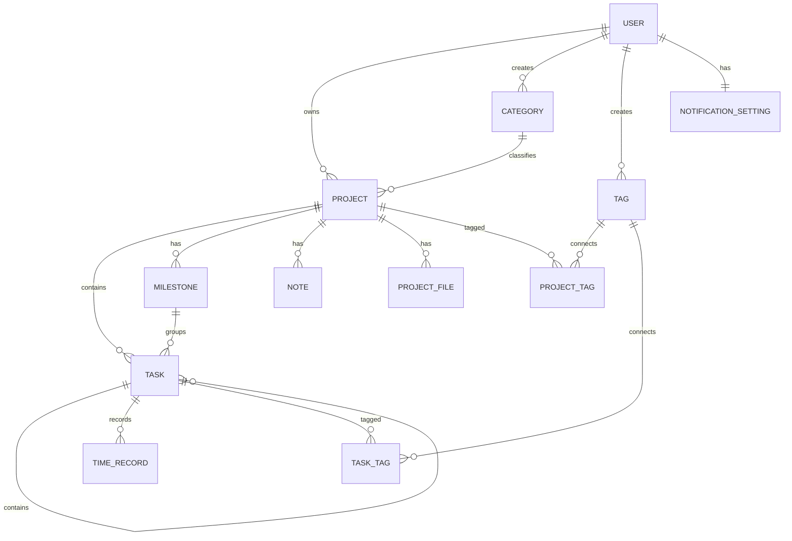

# Task Manager 도메인 설계 확정안

## 1. 도메인 설계 목표

이 애플리케이션은 사용자가 공부, 운동, 과제, 포트폴리오 등 여러 유형의 개인 프로젝트를 생성하고, 프로젝트별 작업과 일정을 관리하며, 진행 상황을 대시보드에서 확인할 수 있도록 한다.

초기 버전에서는 복잡한 협업 기능보다 다음 흐름을 중심으로 설계한다.

사용자 → 프로젝트 생성 → 작업 등록 → 작업 수행 및 완료 → 진행률 확인 → 대시보드 분석

---

# 2. 핵심 도메인

## 2.1 User

서비스를 사용하는 회원이다.

### 주요 속성

| 속성              | 타입       | 설명         |
| --------------- | -------- | ---------- |
| id              | UUID     | 사용자 고유 식별자 |
| email           | String   | 로그인 이메일    |
| passwordHash    | String   | 암호화된 비밀번호  |
| nickname        | String   | 사용자 이름     |
| profileImageUrl | String?  | 프로필 이미지    |
| timezone        | String   | 사용자 시간대    |
| createdAt       | DateTime | 가입일        |
| updatedAt       | DateTime | 수정일        |

### 책임

* 회원가입 및 로그인
* 자신의 프로젝트 관리
* 자신의 작업 및 일정 관리
* 개인 설정 관리

### 관계

* User 1 : N Project
* User 1 : N Category
* User 1 : N Tag
* User 1 : N NotificationSetting

---

## 2.2 Project

사용자가 일정 기간 동안 수행하려는 목표 단위이다.

예시:

* 자료구조 공부
* 주 3회 운동
* 알고리즘 과제
* 포트폴리오 웹 개발

### 주요 속성

| 속성          | 타입            | 설명          |
| ----------- | ------------- | ----------- |
| id          | UUID          | 프로젝트 고유 식별자 |
| userId      | UUID          | 프로젝트 소유 사용자 |
| categoryId  | UUID          | 프로젝트 모드     |
| title       | String        | 프로젝트 이름     |
| description | Text?         | 프로젝트 설명     |
| status      | ProjectStatus | 프로젝트 상태     |
| priority    | Priority      | 우선순위        |
| startDate   | Date?         | 시작일         |
| dueDate     | Date?         | 마감일         |
| progress    | Integer       | 진행률         |
| color       | String?       | 프로젝트 표시 색상  |
| icon        | String?       | 프로젝트 아이콘    |
| isArchived  | Boolean       | 보관 여부       |
| createdAt   | DateTime      | 생성일         |
| updatedAt   | DateTime      | 수정일         |

### ProjectStatus

```text
PLANNED
IN_PROGRESS
PAUSED
COMPLETED
CANCELLED
```

### Priority

```text
LOW
MEDIUM
HIGH
URGENT
```

### 책임

* 프로젝트 기본 정보 관리
* 프로젝트 상태 관리
* 프로젝트 기간 관리
* 작업 진행률 집계
* 프로젝트 보관 처리

### 관계

* Project N : 1 User
* Project N : 1 Category
* Project 1 : N Task
* Project 1 : N Milestone
* Project 1 : N Note
* Project 1 : N ProjectFile
* Project N : M Tag

---

## 2.3 Category

프로젝트의 유형 또는 모드이다.

초기 기본 카테고리는 다음과 같다.

```text
STUDY
EXERCISE
ASSIGNMENT
PORTFOLIO
```

사용자가 추후 커스텀 카테고리를 추가할 수 있도록 일반 엔티티로 설계한다.

### 주요 속성

| 속성        | 타입           | 설명               |
| --------- | ------------ | ---------------- |
| id        | UUID         | 카테고리 식별자         |
| userId    | UUID?        | 사용자 생성 카테고리의 소유자 |
| name      | String       | 카테고리 이름          |
| type      | CategoryType | 기본 또는 사용자 정의     |
| icon      | String?      | 아이콘              |
| color     | String?      | 대표 색상            |
| createdAt | DateTime     | 생성일              |

### CategoryType

```text
SYSTEM
CUSTOM
```

### 책임

* 프로젝트 분류
* 모드별 프로젝트 필터링
* 사용자 정의 모드 확장

### 설계 원칙

공부, 운동, 과제, 포트폴리오를 각각 별도의 프로젝트 엔티티로 만들지 않는다.

모든 프로젝트는 동일한 Project 구조를 사용하고, Category를 통해 유형을 구분한다.

이를 통해 새로운 모드를 추가할 때 데이터베이스 구조를 변경하지 않아도 된다.

---

## 2.4 Task

프로젝트를 수행하기 위한 개별 작업이다.

예시:

* 연결 리스트 강의 듣기
* 5km 달리기
* 보고서 초안 작성
* 로그인 페이지 구현

### 주요 속성

| 속성               | 타입         | 설명       |
| ---------------- | ---------- | -------- |
| id               | UUID       | 작업 식별자   |
| projectId        | UUID       | 소속 프로젝트  |
| parentTaskId     | UUID?      | 상위 작업    |
| title            | String     | 작업 이름    |
| description      | Text?      | 작업 설명    |
| status           | TaskStatus | 작업 상태    |
| priority         | Priority   | 우선순위     |
| startAt          | DateTime?  | 시작 예정 시각 |
| dueAt            | DateTime?  | 마감 시각    |
| completedAt      | DateTime?  | 완료 시각    |
| estimatedMinutes | Integer?   | 예상 소요 시간 |
| actualMinutes    | Integer?   | 실제 소요 시간 |
| orderIndex       | Integer    | 화면 표시 순서 |
| createdAt        | DateTime   | 생성일      |
| updatedAt        | DateTime   | 수정일      |

### TaskStatus

```text
TODO
IN_PROGRESS
COMPLETED
CANCELLED
```

### 책임

* 작업 생성 및 수정
* 작업 완료 상태 관리
* 하위 작업 관리
* 작업 일정 및 소요 시간 관리
* 프로젝트 진행률 계산의 기준 제공

### 관계

* Task N : 1 Project
* Task N : 1 Task
* Task 1 : N Task
* Task N : M Tag
* Task 1 : N TimeRecord

### 하위 작업 규칙

Task는 parentTaskId를 이용해 하위 작업을 가질 수 있다.

초기 MVP에서는 최대 1단계 하위 작업까지만 지원한다.

```text
작업
 └─ 하위 작업
```

무한 중첩 구조는 UI와 진행률 계산을 복잡하게 만들기 때문에 초기 버전에서는 제한한다.

---

## 2.5 Milestone

프로젝트의 주요 단계 또는 중간 목표이다.

예시:

* 자료구조 기본 개념 완료
* 중간고사 대비 완료
* 프론트엔드 구현 완료
* 배포 완료

### 주요 속성

| 속성          | 타입              | 설명       |
| ----------- | --------------- | -------- |
| id          | UUID            | 마일스톤 식별자 |
| projectId   | UUID            | 소속 프로젝트  |
| title       | String          | 마일스톤 이름  |
| description | Text?           | 설명       |
| dueDate     | Date?           | 목표 완료일   |
| status      | MilestoneStatus | 진행 상태    |
| orderIndex  | Integer         | 표시 순서    |
| createdAt   | DateTime        | 생성일      |
| updatedAt   | DateTime        | 수정일      |

### MilestoneStatus

```text
PLANNED
IN_PROGRESS
COMPLETED
```

### 책임

* 프로젝트의 큰 단계 구분
* 장기 프로젝트 진행 상황 표현
* 주요 목표 달성 여부 관리

### 관계

* Milestone N : 1 Project
* Milestone 1 : N Task

Task에 milestoneId를 추가하여 특정 마일스톤에 작업을 연결할 수 있다.

---

## 2.6 Tag

프로젝트와 작업을 추가로 분류하기 위한 사용자 정의 라벨이다.

예시:

```text
C++
시험
백엔드
중요
복습
```

### 주요 속성

| 속성        | 타입       | 설명     |
| --------- | -------- | ------ |
| id        | UUID     | 태그 식별자 |
| userId    | UUID     | 태그 소유자 |
| name      | String   | 태그 이름  |
| color     | String?  | 태그 색상  |
| createdAt | DateTime | 생성일    |

### 관계

* Tag N : 1 User
* Tag N : M Project
* Tag N : M Task

### 중간 테이블

```text
ProjectTag
- projectId
- tagId

TaskTag
- taskId
- tagId
```

---

## 2.7 TimeRecord

사용자가 작업에 실제로 사용한 시간을 기록한다.

### 주요 속성

| 속성              | 타입        | 설명        |
| --------------- | --------- | --------- |
| id              | UUID      | 시간 기록 식별자 |
| taskId          | UUID      | 대상 작업     |
| startedAt       | DateTime  | 시작 시각     |
| endedAt         | DateTime? | 종료 시각     |
| durationMinutes | Integer   | 소요 시간     |
| memo            | String?   | 기록 메모     |
| createdAt       | DateTime  | 생성일       |

### 책임

* 집중 시간 기록
* 실제 작업 시간 계산
* 대시보드 집중 시간 통계 제공

### 관계

* TimeRecord N : 1 Task

---

## 2.8 Note

프로젝트 내에서 작성하는 텍스트 메모이다.

### 주요 속성

| 속성        | 타입       | 설명       |
| --------- | -------- | -------- |
| id        | UUID     | 노트 식별자   |
| projectId | UUID     | 소속 프로젝트  |
| title     | String   | 노트 제목    |
| content   | Text     | 노트 내용    |
| isPinned  | Boolean  | 상단 고정 여부 |
| createdAt | DateTime | 생성일      |
| updatedAt | DateTime | 수정일      |

### 책임

* 프로젝트 관련 기록 저장
* 학습 내용, 아이디어, 회고 작성
* 중요 노트 고정

### 관계

* Note N : 1 Project

---

## 2.9 ProjectFile

프로젝트에 첨부된 파일 정보를 관리한다.

실제 파일 데이터는 서버 파일 시스템 또는 클라우드 스토리지에 저장하고, 데이터베이스에는 파일 정보만 저장한다.

### 주요 속성

| 속성           | 타입       | 설명       |
| ------------ | -------- | -------- |
| id           | UUID     | 파일 식별자   |
| projectId    | UUID     | 소속 프로젝트  |
| originalName | String   | 원본 파일명   |
| storedName   | String   | 저장 파일명   |
| fileUrl      | String   | 파일 접근 주소 |
| mimeType     | String   | 파일 형식    |
| fileSize     | Long     | 파일 크기    |
| createdAt    | DateTime | 업로드 시각   |

### 관계

* ProjectFile N : 1 Project

---

## 2.10 NotificationSetting

사용자의 알림 설정이다.

### 주요 속성

| 속성                    | 타입       | 설명         |
| --------------------- | -------- | ---------- |
| id                    | UUID     | 설정 식별자     |
| userId                | UUID     | 사용자        |
| taskDueEnabled        | Boolean  | 작업 마감 알림   |
| projectDueEnabled     | Boolean  | 프로젝트 마감 알림 |
| dailySummaryEnabled   | Boolean  | 일일 요약 알림   |
| reminderMinutesBefore | Integer  | 마감 전 알림 시간 |
| createdAt             | DateTime | 생성일        |
| updatedAt             | DateTime | 수정일        |

초기 MVP에서는 실제 푸시 알림 대신 애플리케이션 내부 알림 또는 화면 표시만 구현할 수 있다.

---

# 3. 도메인 관계 구조



---

# 4. 도메인 계층 구조

```text
User
├─ Category
├─ Tag
├─ NotificationSetting
└─ Project
   ├─ Milestone
   │  └─ Task
   ├─ Task
   │  ├─ SubTask
   │  ├─ Tag
   │  └─ TimeRecord
   ├─ Note
   ├─ ProjectFile
   └─ Tag
```

---

# 5. 프로젝트 진행률 계산 규칙

프로젝트 진행률은 완료된 작업 비율을 기준으로 자동 계산한다.

```text
프로젝트 진행률
= 완료 작업 수 ÷ 전체 유효 작업 수 × 100
```

계산 대상 상태:

```text
TODO
IN_PROGRESS
COMPLETED
```

계산에서 제외:

```text
CANCELLED
```

예시:

```text
전체 작업 10개
완료 작업 6개
취소 작업 1개

진행률 = 6 ÷ 9 × 100
       = 약 67%
```

### 하위 작업이 있는 경우

하위 작업이 존재하는 상위 작업은 직접 계산 대상에서 제외하고, 가장 하위 단계 작업만 진행률 계산에 사용한다.

```text
로그인 기능 구현
├─ 로그인 UI 구현
├─ API 연결
└─ 유효성 검사
```

위 구조에서는 상위 작업인 `로그인 기능 구현`이 아니라 하위 작업 3개를 계산한다.

---

# 6. 프로젝트 상태 자동 전환 규칙

프로젝트 상태는 사용자가 직접 수정할 수 있지만 일부 상태는 자동으로 제안할 수 있다.

| 조건               | 상태          |
| ---------------- | ----------- |
| 생성 직후 작업이 없는 경우  | PLANNED     |
| 작업이 시작된 경우       | IN_PROGRESS |
| 모든 유효 작업이 완료된 경우 | COMPLETED   |
| 사용자가 일시 중지한 경우   | PAUSED      |
| 사용자가 취소한 경우      | CANCELLED   |

자동 변경보다는 사용자 의도와 충돌하지 않도록 상태 변경을 제안하는 방식이 적절하다.

예시:

```text
모든 작업이 완료되었습니다.
프로젝트를 완료 상태로 변경하시겠습니까?
```

---

# 7. 화면별 사용 도메인

## 홈 화면

사용 도메인:

```text
User
Project
Category
Task
Tag
```

주요 기능:

* 프로젝트 목록 조회
* 카테고리별 필터링
* 프로젝트 검색
* 프로젝트 진행률 표시
* 프로젝트 생성
* 프로젝트 정렬
* 마감일 표시

---

## 프로젝트 상세 화면

사용 도메인:

```text
Project
Task
Milestone
Tag
Note
ProjectFile
TimeRecord
```

주요 기능:

* 프로젝트 기본 정보 조회
* 작업 생성 및 완료
* 마일스톤 관리
* 일정 조회
* 노트 작성
* 파일 첨부
* 시간 기록
* 진행률 확인

---

## 대시보드

사용 도메인:

```text
Project
Task
Category
TimeRecord
```

주요 지표:

* 전체 프로젝트 수
* 진행 중 프로젝트 수
* 평균 완료율
* 완료 작업 수
* 카테고리별 진행률
* 주간 작업 완료 수
* 총 집중 시간
* 다가오는 마감
* 최근 활동

대시보드는 별도의 데이터 엔티티라기보다 기존 도메인 데이터를 집계하여 보여주는 조회 기능으로 설계한다.

---

# 8. MVP 포함 범위

## 반드시 구현

```text
User
Project
Category
Task
Tag
Milestone
프로젝트 진행률
프로젝트 검색 및 필터
마감일 관리
대시보드 기본 통계
```

## 구현 권장

```text
Note
TimeRecord
하위 작업
사용자 정의 Category
```

## 후순위 구현

```text
ProjectFile
Notification
반복 작업
캘린더 외부 연동
협업 기능
데이터 내보내기
```

---

# 9. 현재 단계에서 제외할 도메인

초기 버전의 복잡도를 줄이기 위해 다음 기능은 제외한다.

```text
Team
Workspace
ProjectMember
Comment
Chat
Role
Permission
Subscription
Payment
ActivityLog
ExternalCalendar
```

사용자 수 증가나 협업 기능 추가가 필요해질 경우 별도의 확장 단계에서 도입한다.

---

# 10. 최종 확정 엔티티

## 핵심 엔티티

```text
User
Project
Category
Task
Milestone
Tag
```

## 지원 엔티티

```text
TimeRecord
Note
ProjectFile
NotificationSetting
```

## 관계 테이블

```text
ProjectTag
TaskTag
```

총 엔티티 수:

```text
일반 엔티티 10개
관계 엔티티 2개
총 12개
```

---

# 11. 도메인 설계 확정 결론

본 애플리케이션의 중심 Aggregate는 Project이다.

```text
Project
├─ Task
├─ Milestone
├─ Note
├─ ProjectFile
└─ Tag
```

User는 모든 데이터의 소유권을 관리하며, Category는 프로젝트 유형을 구분한다.

공부, 운동, 과제, 포트폴리오 모드는 별도의 데이터 모델이 아니라 Category 데이터로 처리한다.

이 구조는 초기 MVP를 구현하기에 충분하며, 추후 다음 기능을 추가하더라도 기존 핵심 구조를 크게 변경하지 않아도 된다.

```text
사용자 정의 프로젝트 모드
반복 작업
협업 프로젝트
알림
외부 캘린더 연동
고급 통계
```

따라서 이 도메인 모델을 기준으로 다음 단계인 ERD 및 데이터베이스 테이블 설계를 진행한다.
