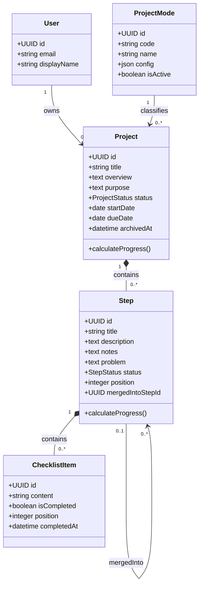
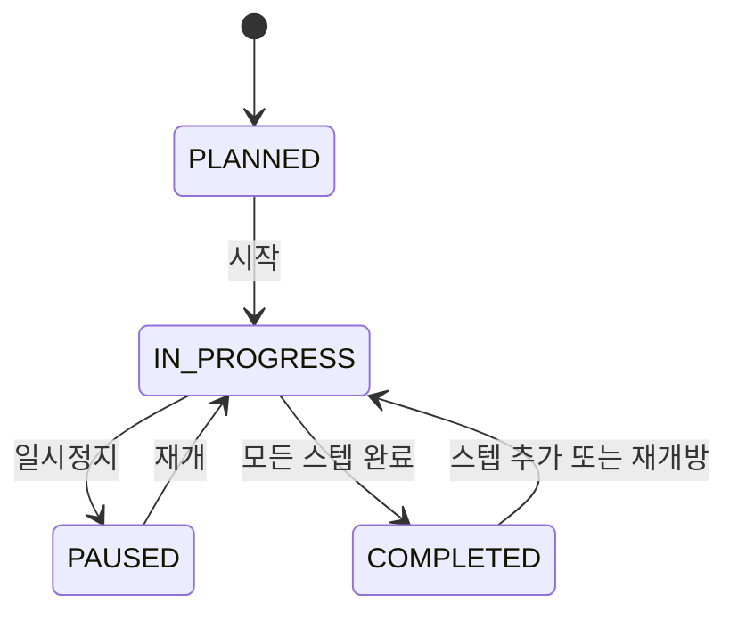
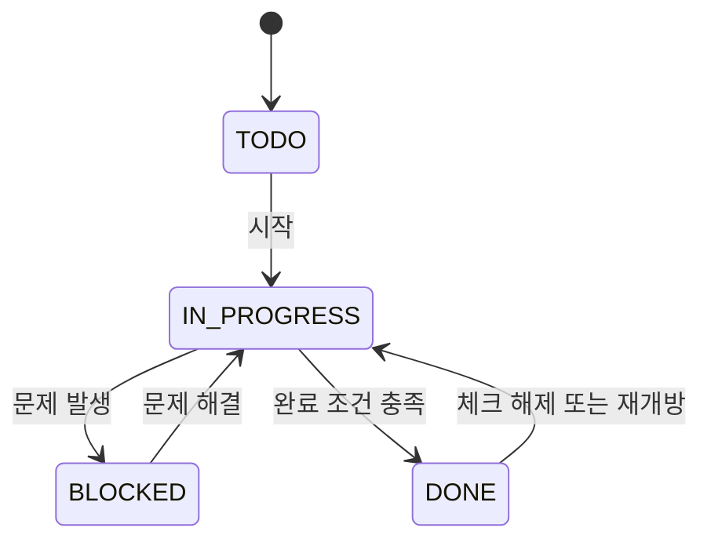

# 개인 프로젝트 관리 웹앱 — 도메인 설계서 v0.1

## 1. 제품 한 문장

사용자가 공부·운동·과제·포트폴리오 같은 개인 프로젝트를 스텝과 체크리스트로 나누고, 진행률·문제·미완료 작업을 한곳에서 관리하는 웹 애플리케이션이다.

## 2. MVP 범위

### 포함

- 공부, 운동, 과제, 포트폴리오 4개 모드
- 프로젝트 생성·조회·수정·시작·일시정지·완료·보관
- 스텝 생성·수정·삭제·이름 변경·순서 변경·병합
- 스텝별 설명, 참고사항/소목적, 문제점
- 스텝별 체크리스트 생성·수정·완료·삭제·순서 변경
- 전체 미완료 항목 모아보기
- 프로젝트 진행률과 전체 대시보드
- 홈의 진행 중·완료·보관 프로젝트 목록

### MVP에서 제외

- 다중 사용자 협업과 공유
- 반복 일정, 캘린더, 알림
- 파일·이미지 첨부
- 스텝 의존성
- AI 자동 계획 생성
- 오프라인 동기화

## 3. 핵심 설계 원칙

1. 네 가지 모드는 별도 프로젝트 종류가 아니라 `ProjectMode` 데이터다.
2. 모든 모드가 동일한 `Project → Step → ChecklistItem` 구조를 사용한다.
3. 진행률은 저장하지 않고 현재 스텝과 체크리스트 상태에서 계산한다.
4. 프로젝트 상태를 바꾸는 핵심 규칙은 프론트가 아니라 백엔드 Service가 책임진다.
5. 삭제보다 보관과 소프트 삭제를 우선해 사용자의 기록을 보호한다.

## 4. 도메인 용어

| 용어 | 의미 |
| --- | --- |
| 사용자(User) | 프로젝트를 소유하고 관리하는 사람 |
| 모드(ProjectMode) | 공부·운동·과제·포트폴리오처럼 프로젝트를 분류하고 표시 방식을 정하는 데이터 |
| 프로젝트(Project) | 하나의 목표와 목적을 가진 최상위 작업 단위 |
| 스텝(Step) | 프로젝트를 완성하기 위한 순서 있는 단계 |
| 체크리스트 항목(ChecklistItem) | 한 스텝 안에서 완료 여부를 확인하는 최소 실행 단위 |
| 문제(Problem) | 스텝 진행 중 발생한 애로사항이나 해결이 필요한 내용 |
| 참고사항(Notes) | 자료, 소목적, 진행 메모 등 스텝 수행에 필요한 자유 기록 |
| 기능 설명(Description) | 해당 스텝이 왜 존재하고 무엇을 수행하는지 설명하는 내용 |
| 미완료 항목 | 완료되지 않았으며 삭제·병합된 스텝에 속하지 않은 체크리스트 항목 |
| 진행률 | 활성 스텝들의 완료 정도를 계산한 파생 값 |

## 5. 핵심 모델



### 5.1 User

MVP 개발 중에는 시드로 만든 사용자 1명을 사용한다. 공개 배포 전에 인증을 붙이더라도 다른 도메인 구조를 바꾸지 않도록 모든 프로젝트는 처음부터 `userId`를 가진다.

### 5.2 ProjectMode

초기 모드는 다음 네 행으로 등록한다.

| code | 이름 |
| --- | --- |
| `STUDY` | 공부 |
| `WORKOUT` | 운동 |
| `ASSIGNMENT` | 과제 |
| `PORTFOLIO` | 포트폴리오 |

새 모드는 테이블에 행을 추가해 확장한다. 모드별 프로젝트 테이블이나 상세 페이지를 만들지 않는다.

### 5.3 Project

필수 속성은 `title`, `modeId`, `userId`다. `overview`는 프로젝트가 무엇인지, `purpose`는 왜 수행하는지를 기록한다.

프로젝트 상태:

- `PLANNED`: 아직 시작하지 않음
- `IN_PROGRESS`: 진행 중
- `PAUSED`: 사용자가 일시정지
- `COMPLETED`: 모든 활성 스텝 완료

`ARCHIVED`는 상태 값으로 두지 않고 `archivedAt` 존재 여부로 판단한다. 이렇게 하면 완료 프로젝트도 보관할 수 있다.

### 5.4 Step

필수 속성은 `projectId`, `title`, `position`이다.

- `description`: 스텝의 역할과 수행 기능
- `notes`: 참고사항, 소목적, 링크나 자유 메모
- `problem`: 애로사항과 해결이 필요한 문제
- `position`: 프로젝트 안에서 보이는 순서, 0부터 연속된 정수

스텝 상태:

- `TODO`: 시작 전
- `IN_PROGRESS`: 진행 중
- `BLOCKED`: 문제로 인해 진행 불가
- `DONE`: 완료

### 5.5 ChecklistItem

필수 속성은 `stepId`, `content`, `position`이다. 완료되면 `isCompleted=true`와 함께 `completedAt`을 기록한다. 다시 미완료로 바꾸면 `completedAt=null`로 되돌린다.

## 6. 상태 변화

### 프로젝트



### 스텝



## 7. 비즈니스 규칙

### 7.1 프로젝트

1. 프로젝트 제목은 공백 제거 후 1~100자다.
2. 프로젝트는 반드시 활성 모드 하나에 속한다.
3. 보관된 프로젝트는 읽을 수 있지만 수정할 수 없다. 먼저 복구해야 한다.
4. 스텝이 하나 이상이고 모든 활성 스텝이 `DONE`이면 프로젝트는 자동으로 `COMPLETED`가 된다.
5. 완료 프로젝트에 새 스텝을 추가하거나 완료 스텝을 다시 열면 프로젝트는 `IN_PROGRESS`가 된다.
6. 스텝이 없는 프로젝트의 진행률은 0%다.

### 7.2 스텝

1. 스텝 제목은 공백 제거 후 1~100자다.
2. 한 스텝은 반드시 하나의 프로젝트에만 속한다.
3. 활성 스텝의 `position`은 0부터 중복 없이 이어져야 한다.
4. 체크리스트가 있는 스텝에서 모든 항목이 완료되면 스텝을 자동으로 `DONE` 처리한다.
5. 완료된 체크리스트를 다시 해제하면 `DONE` 스텝은 `IN_PROGRESS`로 돌아간다.
6. 체크리스트가 없는 스텝은 사용자가 직접 `DONE`으로 변경한다.
7. `BLOCKED` 상태에서는 `problem` 입력을 필수로 한다.
8. 병합되거나 삭제된 스텝은 진행률과 미완료 목록에서 제외한다.

### 7.3 체크리스트

1. 항목 내용은 공백 제거 후 1~200자다.
2. 체크리스트 순서는 스텝마다 독립적이다.
3. 항목 추가·삭제·완료 변경 후 스텝과 프로젝트 상태를 다시 평가한다.
4. 완료 항목도 삭제할 수 있지만 삭제 전 확인을 받는다.

## 8. 진행률 규칙

### 스텝 진행률

```text
스텝 상태가 DONE                      → 100%
체크리스트가 있고 DONE이 아닌 경우    → 완료 항목 수 / 전체 항목 수 × 100
체크리스트가 없고 DONE이 아닌 경우    → 0%
```

### 프로젝트 진행률

```text
활성 스텝이 없는 경우 → 0%
그 외                  → 활성 스텝 진행률 합 / 활성 스텝 수
```

- 화면에서는 반올림한 정수를 표시한다.
- DB에 `progress` 값을 저장하지 않는다.
- 병합·삭제된 스텝은 계산 대상에서 제외한다.
- `PAUSED`는 진행률 계산 방식에 영향을 주지 않는다.

## 9. 스텝 병합 규칙

병합은 단순 이름 변경이 아니라 여러 데이터를 한 스텝으로 옮기는 원자적 작업이다.

### 입력

- 같은 프로젝트에 속한 활성 스텝 2개 이상
- 결과를 유지할 대상 스텝 1개
- 결과 스텝 제목

### 처리 순서

1. 모든 스텝이 같은 프로젝트에 속하는지 검증한다.
2. 대상 스텝의 위치를 병합 대상 중 가장 앞선 위치로 정한다.
3. 원본 순서를 유지하면서 체크리스트를 대상 스텝으로 이동한다.
4. `description`, `notes`, `problem`은 원본 스텝 제목을 소제목으로 붙여 합친다.
5. 대상 스텝의 상태와 진행률을 다시 계산한다.
6. 나머지 스텝에 `mergedIntoStepId`와 `deletedAt`을 기록한다.
7. 남은 활성 스텝의 위치를 0부터 다시 정렬한다.

위 작업 전체는 하나의 DB 트랜잭션으로 처리한다. 중간 단계에서 오류가 발생하면 어느 변경도 저장하지 않는다.

## 10. 주요 사용 사례

| ID | 사용 사례 | 결과 |
| --- | --- | --- |
| `UC-P01` | 모드를 선택해 프로젝트 생성 | `PLANNED` 프로젝트 생성 |
| `UC-P02` | 프로젝트 시작·일시정지·재개 | 상태 변경 |
| `UC-P03` | 프로젝트 정보 수정 | 개요·목적·기한 변경 |
| `UC-P04` | 프로젝트 보관·복구 | `archivedAt` 설정·해제 |
| `UC-S01` | 스텝 추가 | 마지막 위치에 `TODO` 스텝 추가 |
| `UC-S02` | 스텝 정보·이름 수정 | 설명·메모·문제·제목 변경 |
| `UC-S03` | 스텝 순서 변경 | 위치를 트랜잭션으로 재정렬 |
| `UC-S04` | 여러 스텝 병합 | 대상 스텝으로 내용과 체크리스트 통합 |
| `UC-C01` | 체크리스트 추가·수정·삭제 | 스텝 세부 작업 변경 |
| `UC-C02` | 체크리스트 완료·해제 | 완료 시각·진행률·상태 갱신 |
| `UC-V01` | 미완료 항목 모아보기 | 프로젝트·모드별 미완료 항목 조회 |
| `UC-D01` | 대시보드 조회 | 전체·모드별 프로젝트와 진행률 집계 |

## 11. 조회 화면에 필요한 파생 데이터

### 홈

- 진행 중 프로젝트
- 계획된 프로젝트
- 완료 프로젝트
- 보관 프로젝트
- 각 프로젝트의 모드, 진행률, 다음 미완료 항목, 수정 시각

### 프로젝트 상세

- 프로젝트 개요와 목적
- 프로젝트 상태와 진행률
- 완료·전체 스텝 수
- 완료·전체 체크리스트 수
- 위치순 활성 스텝과 각 스텝 진행률
- 해당 프로젝트의 미완료 항목

### 전체 대시보드

- 전체·진행 중·완료 프로젝트 수
- 전체 평균 진행률
- 모드별 프로젝트 수와 평균 진행률
- 최근 수정 프로젝트
- 전체 미완료 체크리스트 수
- 마감일이 가까운 프로젝트

## 12. 도메인 경계와 책임

| 계층 | 책임 |
| --- | --- |
| React | 입력 폼, 목록, 진행률 시각화, 사용자 상호작용 |
| Express Route | URL과 HTTP 메서드 연결 |
| Zod Validator | 입력 형식·길이·필수 값 검증 |
| Service | 상태 변화, 진행률 평가, 병합, 순서 변경 등 도메인 규칙 |
| Prisma | Service의 저장·조회 요청을 DB 작업으로 변환 |
| PostgreSQL | 프로젝트·스텝·체크리스트 영구 저장과 트랜잭션 보장 |

프론트엔드는 진행률이나 완료 상태를 최종 결정하지 않는다. 화면에서 임시 값을 보여줄 수는 있지만 서버 응답을 최종 상태로 사용한다.

## 13. 완료 기준

도메인 설계 1단계는 다음 조건을 모두 만족하면 완료로 본다.

- [x] 제품 범위와 제외 범위 정의
- [x] 공통 도메인 용어 정의
- [x] 핵심 엔티티와 관계 정의
- [x] 프로젝트·스텝 상태 정의
- [x] 진행률 계산 규칙 정의
- [x] 스텝 병합 규칙 정의
- [x] 주요 사용 사례 정의
- [x] 홈·상세·대시보드 조회 데이터 정의
- [ ] 실제 화면 와이어프레임으로 검증
- [ ] Prisma 스키마와 REST API 명세로 변환

다음 작업은 이 문서를 기준으로 홈·프로젝트 상세·대시보드의 저해상도 와이어프레임을 만들고, 필요한 정보가 빠진 곳이 없는지 검증하는 것이다.
